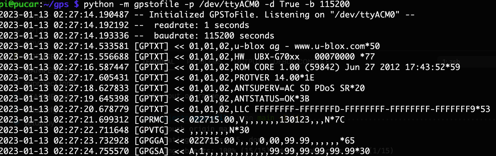

# GPSToFile

Quick and easy way to read GPS sentences to file with no gpsd required.



## Getting Started

The only required library is pyserial:

`pip install -r requirements.txt`

Once you get the serial path of your GPS modem, you can get started:

```python
from gpstofile import GPSToFile

gps = GPSToFile('/dev/tty.usbmodem14401', readrate=1, debug=True)

gps.loop()
```

